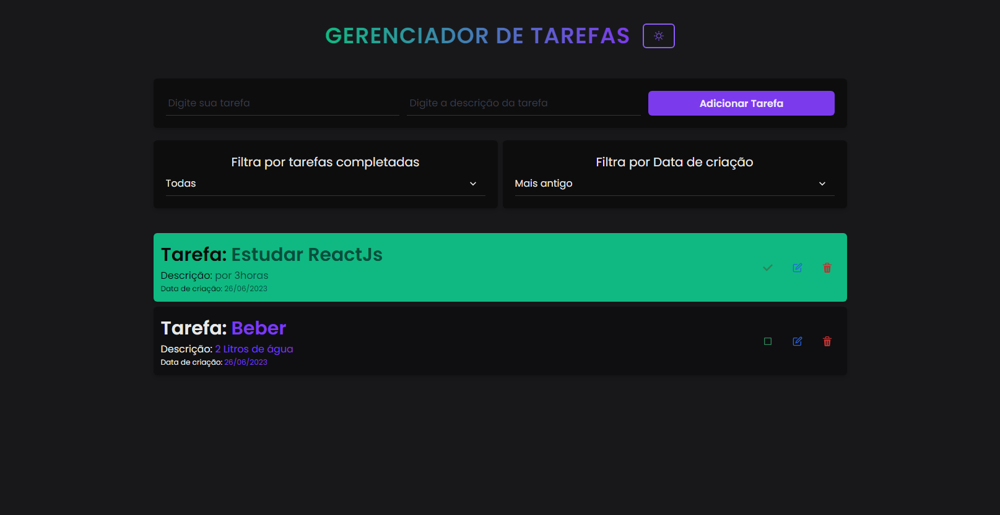
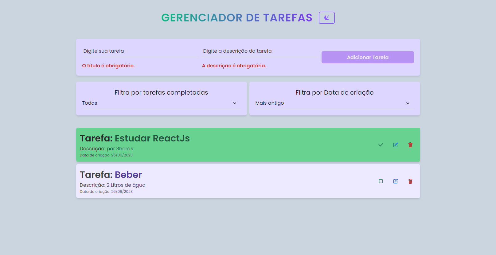

# Gerenciador de Tarefas

Tema Dark

Tema Light

## Executando a Aplicação Localmente

Siga as instruções abaixo para executar a aplicação do Sistema de
Gerenciamento de Tarefas localmente em seu computador.

## Pré-requisitos

Node.js instalado (versão 12 ou superior)
NPM (Node Package Manager) instalado

## Passo a Passo

1. Clone o repositório para o seu computador usando o seguinte comando:

#### `git clone <URL do repositório>`

2. Acesse o diretório do projeto:

#### `cd task-manager`

3. Instale as dependências do projeto:

#### `npm install`

4. Execute a aplicação:

#### `npm start`

5. O servidor de desenvolvimento será iniciado e a aplicação estará disponível em seu navegador no endereço http://localhost:3000.

## Tecnologia utilizadas no desenvolvimento

- ReactJs
- Redux
- Javascript
- CSS3
- Chakra-UI
- Dayjs

## Descrição

A Lista de tarefas é exibida na página inicial.
Ao clicar em uma tarefa, ela será marcada como concluída e exibirá um estilo visual diferente.
Você pode filtrar as tarefas por status (concluídas ou pendentes) usando os botões de filtro.
As tarefas podem ser ordenadas por data de criação (mais recentes primeiro ou mais antigas primeiro).
Para editar uma tarefa, clique no botão "Editar" ao lado da tarefa desejada. Um modal será exibido com os campos de título e descrição Faça as alterações desejadas e clique em "Salvar" para salvar as alterações ou "Cancelar" para fechar o modal sem salvar.
Agora você pode executar a aplicação localmente e utilizar todas as funcionalidades do Sistema de Gerenciamento de Tarefas.
